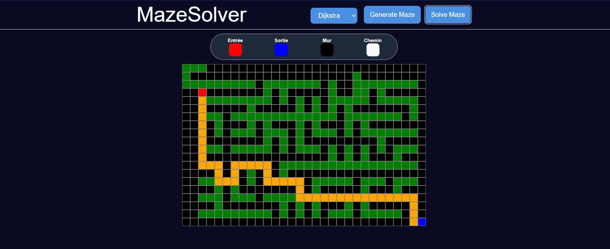

# ProjectMazeSolver

[Voir la vidéo](my-maze-app/src/assets/demo.mp4)

# ProjectMazeSolver

ProjectMazeSolver fournit un petit serveur C++ qui génère et résout des labyrinthes, et une application frontend (React/Vite) qui consomme l'API pour afficher/contrôler le labyrinthe.

## Architecture
- Backend (C++) :
  - `Maze.h` / `Maze.cpp` : génération de labyrinthe (algorithme par frontiers) et résolution par `BFS` et `Dijkstra`.
  - `Cellule.h` : représentation d'une cellule et énumération des états.
  - `MazeSolver.cpp` : serveur HTTP (utilise `httplib.hpp` et `jsoncpp`) exposant les endpoints `GET /generate` et `POST /solve`.
- Frontend :
  - Dossier `my-maze-app` : application React (Vite) qui utilise l'API pour afficher le labyrinthe et l'animation de la résolution.

## Prérequis
- Outils de compilation C++ (g++/clang ou Visual Studio 2022).
- Bibliothèques : `jsoncpp` (lib + headers), `httplib.hpp` (header-only).
- Node.js (pour le frontend) et npm ou yarn.

## États de cellule (`CellState`)
Les valeurs renvoyées dans le JSON correspondent à l'énumération :
- `wall = 1`
- `start = 2`
- `out = 3`
- `none = 4`
- `inRaod = 5`
- `visited = 6`

## API (backend)
Le serveur écoute par défaut sur `0.0.0.0:8080`.

- GET /generate  
  - Description : génère un labyrinthe (taille fixe actuelle : 20×30) et renvoie la grille.
  - Réponse JSON :  
    `{ "maze": [[int,int,...], [...], ...] }` (matrice d'entiers correspondant à `CellState`).

- POST /solve  
  - Description : reçoit une grille et un choix d'algorithme, renvoie les étapes visitées et le chemin trouvé.
  - Corps JSON attendu :
    {
      "grid": [[int,...], ...],
      "algo": 1    // 1 => Dijkstra, autre => BFS
    }
  - Réponse JSON :
    {
      "steps": [[x,y],[x,y],...], // positions visitées (pour animation)
      "path": [[x,y],[x,y],...]   // chemin de l'entrée à la sortie
    }

Exemples curl :
- Générer :
  curl http://localhost:8080/generate
- Résoudre :
  curl -X POST http://localhost:8080/solve -H "Content-Type: application/json" -d "{\"grid\": [[1,4,...]], \"algo\":1}"

## Compilation et exécution (suggestions)

Option A — Compilation rapide avec g++ (Linux / MinGW)  
(adaptez les chemins des headers/lib pour `jsoncpp` et `httplib.hpp`) :
